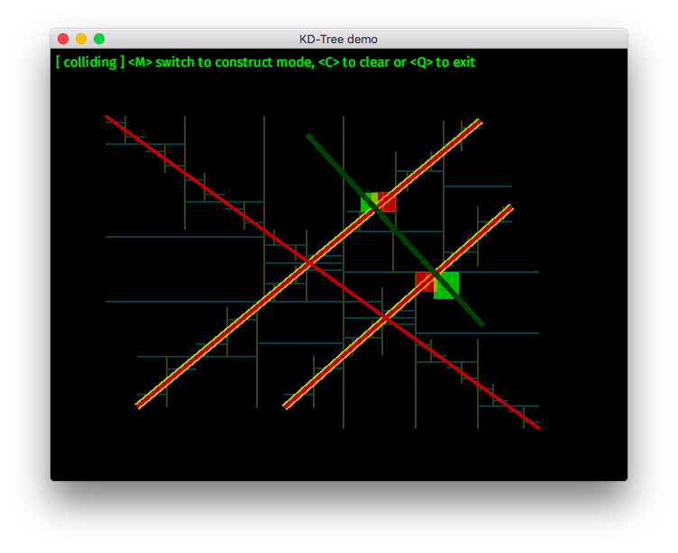

# K-dimensional tree space-partitioning data structure demo

## Overview

A visualizer for [kdtree](https://github.com/swizard0/kdtree) library.



Please see [this screencast](https://youtu.be/llYTyatH1ps) clip for usage hints (collision detector) or [this](https://youtu.be/zXnJgRj0zdQ) for nearest neighbours search.

## Build instructions

```
% git clone https://github.com/swizard0/kdtree-demo
% cd kdtree-demo
% cargo run --release
```
